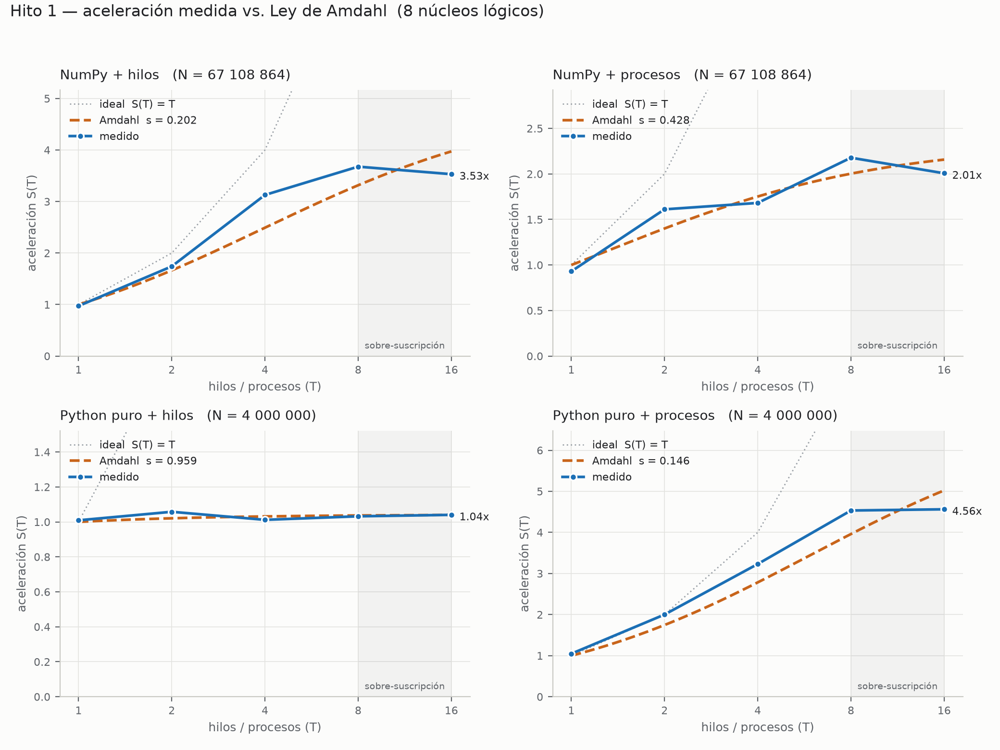

# Hito 1 — Concurrencia en CPU

**Materia:** Programación Concurrente — UNaB, 2026
**Integrantes:** Priscila Ohannecian · Agustín Barrientos · Marcelo Daniel Burgos
**Fecha:** _(entrega, Clase 4)_

---

## 1. Problema y diseño

**Suma de un vector de `float32`.** Mantuvimos el problema del esqueleto de la
materia.

La implementación es en Python.

La versión paralela reparte el vector en bloques mediante una **cola dinámica**
que los trabajadores consumen a demanda. Dos usos de `Lock`: uno protege el
índice del próximo bloque, otro el acumulador global. La suma de cada bloque
ocurre **fuera** de las secciones críticas, y cada trabajador acumula un parcial
privado que vuelca una sola vez al terminar.

Se cruzan dos ejes, dando cuatro combinaciones del mismo algoritmo:

- **Backend:** `numpy` (`ndarray.sum()`, bucle en C que **libera el GIL**) y
  `puro` (bucle de Python, con el GIL tomado).
- **Ejecución:** hilos (`threading`) y procesos (`multiprocessing` sobre
  `RawArray` en memoria compartida).

## 2. Metodología

Hardware completo en el [README raíz](../../README.md): Intel i7-6700,
**4 núcleos físicos / 8 lógicos**, 16 GB DDR4-2133 doble canal, Windows 10.
Python 3.14 · NumPy 2.5.3. Arranque de procesos: `spawn`.

| | numpy | puro |
|---|---|---|
| N | 67 108 864 (2²⁶, 268,4 MB) | 4 000 000 |
| Tamaño de bloque | 524 288 | 31 250 |
| Bloques | 128 | 128 |

```
python benchmark.py --n 67108864 --n-puro 4000000 --repeticiones 7
python graficar.py
```

Se reporta la **mediana de 7 corridas**. Decisiones que condicionan la lectura:

1. Cada combinación se compara contra **su propia referencia secuencial**
   (mismo backend, mismo bloque, un hilo). Los dos backends tienen N distintos
   porque el puro es ~144x más lento; no comparamos S(T) entre backends.
2. El tamaño de bloque es **fijo dentro de cada combinación**.
3. La creación de **hilos** entra en el cronómetro; la de **procesos** no. Con
   `spawn` cuesta decenas de ms y taparía el cálculo, así que se mide aparte
   (`t_arranque`) y se reporta también `speedup_con_arranque`. **Los S(T) de
   las secciones 3 y 4 son con el pool ya levantado.**

**Verificación:** las 24 corridas devolvieron la suma correcta dentro de una
tolerancia relativa de 1e-9 (`ok=True` en todo el CSV). El acumulador es
`float64` aunque el vector sea `float32`: en `float32` la suma se estancaría en
2²⁴ = 16 777 216, muy por debajo de nuestro N.

## 3. Resultados

**NumPy + hilos** — `T_seq = 0,056211 s`

| T | t mediana (s) | t min | t max | S(T) | E(T) | e (K-F) |
|---|---|---|---|---|---|---|
| 1 | 0,057816 | 0,056031 | 0,067256 | 0,972 | 0,972 | — |
| 2 | 0,032292 | 0,028899 | 0,044612 | 1,741 | 0,870 | 0,149 |
| 4 | 0,017972 | 0,016904 | 0,024255 | 3,128 | 0,782 | 0,093 |
| 8 | **0,015287** | 0,014848 | 0,017067 | **3,677** | 0,460 | 0,168 |
| 16 | 0,015920 | 0,015231 | 0,016814 | 3,531 | 0,221 | 0,235 |

**NumPy + procesos** — `T_seq = 0,056831 s`

| T | t mediana (s) | t arranque | S(T) | S c/arranque | E(T) | e (K-F) |
|---|---|---|---|---|---|---|
| 1 | 0,061110 | 0,2815 | 0,930 | 0,166 | 0,930 | — |
| 2 | 0,035271 | 0,2379 | 1,611 | 0,208 | 0,806 | 0,241 |
| 4 | 0,033794 | 0,2800 | 1,682 | 0,181 | 0,420 | 0,460 |
| 8 | **0,026091** | 0,4215 | **2,178** | 0,127 | 0,272 | 0,382 |
| 16 | 0,028316 | 0,8266 | 2,007 | 0,067 | 0,125 | 0,465 |

**Python puro + hilos** — `T_seq = 0,482280 s`

| T | t mediana (s) | t min | t max | S(T) | E(T) | e (K-F) |
|---|---|---|---|---|---|---|
| 1 | 0,477915 | 0,437965 | 0,523551 | 1,009 | 1,009 | — |
| 2 | 0,455937 | 0,439004 | 0,548981 | 1,058 | 0,529 | 0,891 |
| 4 | 0,476657 | 0,425628 | 0,486224 | 1,012 | 0,253 | 0,985 |
| 8 | 0,467308 | 0,449710 | 0,521067 | 1,032 | 0,129 | 0,965 |
| 16 | 0,463590 | 0,435593 | 0,501248 | **1,040** | 0,065 | 0,959 |

**Python puro + procesos** — `T_seq = 0,464894 s`

| T | t mediana (s) | t arranque | S(T) | S c/arranque | E(T) | e (K-F) |
|---|---|---|---|---|---|---|
| 1 | 0,443960 | 0,2310 | 1,047 | 0,689 | 1,047 | — |
| 2 | 0,232416 | 0,2291 | 2,000 | 1,007 | **1,000** | −0,000 |
| 4 | 0,143911 | 0,2596 | 3,230 | **1,152** | 0,808 | 0,079 |
| 8 | 0,102551 | 0,3865 | 4,533 | 0,951 | 0,567 | 0,109 |
| 16 | **0,101894** | 0,8903 | **4,563** | 0,469 | 0,285 | 0,167 |

Fracción secuencial ajustada por mínimos cuadrados sobre los puntos medidos:

| combinación | `s` | techo 1/s | e (K-F) T=2 | e (K-F) T=16 |
|---|---|---|---|---|
| numpy-hilos | 0,202 | 4,95x | 0,149 | 0,235 |
| numpy-procesos | 0,428 | 2,34x | 0,241 | 0,465 |
| puro-hilos | 0,959 | 1,04x | 0,891 | 0,959 |
| puro-procesos | 0,146 | 6,85x | −0,000 | 0,167 |



## 4. Análisis: por qué la curva medida difiere de la teórica

**4.1 El GIL domina, y se aísla en un par de filas.** Mismo algoritmo, mismo
N = 4 000 000, misma máquina; lo único que cambia es hilos contra procesos:
**1,04x** frente a **4,56x**. El bucle `for x in a[ini:fin]` ejecuta bytecode de
CPython y el GIL garantiza que sólo un hilo lo ejecute a la vez: los 16 hilos
existen y se alternan, pero nunca calculan simultáneamente. Karp-Flatt lo
confirma: entre 0,891 y 0,985 para todo T, es decir, el programa se comporta
como si el 90-98 % fuera secuencial. Con procesos arranca en −0,0001
(paralelismo perfecto con 2) y sube sólo hasta 0,167.

**4.2 La optimización que más rindió no fue el paralelismo.** Con el mismo
mecanismo de hilos que no acelera nada en el backend puro, NumPy llega a 3,68x:
`ndarray.sum()` libera el GIL. Pero lo decisivo es la escala relativa:

| | rendimiento secuencial |
|---|---|
| bucle de Python | 8,3 millones de elementos/s |
| `ndarray.sum()` | 1 194 millones de elementos/s |

Reemplazar el bucle por NumPy da **144x**; paralelizar el bucle con 8 procesos
da 4,5x. La primera decisión de optimización no fue cuántos núcleos usar, sino
qué ejecuta cada núcleo.

**4.3 El techo son los 4 núcleos físicos, no los 8 lógicos.** `os.cpu_count()`
devuelve 8, pero el i7-6700 tiene 4 núcleos con hyper-threading: dos hilos
lógicos comparten las unidades de ejecución de un núcleo. Las dos curvas que
escalan saturan cerca de 4 (3,68x y 4,56x), y con T = 16 ninguna mejora —
numpy-hilos incluso cae de 3,677x a 3,531x.

El aporte del HT (T = 4 → T = 8) no es uniforme:

| combinación | S(4) | S(8) | ganancia |
|---|---|---|---|
| NumPy + hilos | 3,128 | 3,677 | **+17,6 %** |
| Python puro + procesos | 3,230 | 4,533 | **+40,3 %** |

Esa diferencia es el mecanismo del HT: el segundo hilo lógico aprovecha los
huecos en que el primero está detenido. El bucle de Python se detiene mucho
—despacho de bytecode, saltos dependientes, fallos de caché— y hay huecos de
sobra. La suma de NumPy es un bucle vectorizado regular que deja poco libre.
**El HT rinde en proporción a cuánto se detiene el trabajo original.**

**El ancho de banda contribuye, pero no está saturado.** Caudal efectivo sobre
los 268,4 MB: 4,8 GB/s secuencial, **17,6 GB/s** con 8 hilos. El pico teórico
de esta máquina es **34,1 GB/s** (DDR4-2133 × 8 bytes × 2 canales), así que
estamos al **51,5 %**. Es alto y el bus pesa, pero no alcanza para afirmar
saturación: la restricción dominante son los 4 núcleos físicos.

**4.4 Procesos no es "mejor que hilos".** Con backend NumPy los procesos son
**peores**: 2,18x contra 3,68x. Cuando el GIL no es el cuello de botella, sólo
agregan costo — el `Lock` entre procesos es un semáforo del SO (mucho más caro
que un `threading.Lock` sin contención) y cada ronda paga colas con
serialización. La dispersión lo respalda: en numpy-procesos con T = 1 el máximo
(0,169 s) es casi 3 veces la mediana. Conclusión operativa: **hilos si el
trabajo libera el GIL; procesos si es bytecode de Python.**

**4.5 El costo de arrancar procesos.** Ajustando una recta a `t_arranque`
contra T: ≈ **121 ms fijos + 45 ms por proceso** (combinación pura). Con 16
procesos son 0,89 s sólo para tener listos a los trabajadores, ocho veces más
que el cálculo (0,10 s). Por eso `speedup_con_arranque` casi nunca supera 1: el
único punto donde paralelizar una sola vez conviene es puro-procesos con T = 4,
y apenas (**1,15x**). Esto no invalida 4.1, lo acota: el paralelismo por
procesos rinde cuando el pool se reutiliza, o con un N lo bastante grande como
para amortizar el arranque (con estos números, unas diez veces mayor).

**4.6 `s` ajustado contra Karp-Flatt.** Lo importante es la **tendencia** de
`e`, no su valor absoluto. Si la única pérdida fuera una fracción secuencial
fija, `e` sería constante en T. En las tres combinaciones que escalan, `e`
**crece**: la pérdida no es código secuencial sino sobrecarga de paralelización
que aumenta con la cantidad de trabajadores. `puro-hilos` es el contraejemplo
instructivo: ahí `e` sí es prácticamente constante y cercano a 1, porque el GIL
se comporta como una fracción secuencial genuina — literalmente serializa.

## 5. Aprendizajes

- Sacar el `Lock` del acumulador y correr con 16 hilos: qué pasó y por qué el
  resultado falla a veces y no siempre.
- La primera versión incluía la creación de procesos dentro del cronómetro y
  daba speedups menores a 1 que parecían un bug. Qué nos hizo sospechar.
- `os.cpu_count()` devuelve 8 pero el paralelismo útil es 4: confiar en ese
  número habría llevado a una conclusión equivocada.

## 6. Hacia el Hito 2

Se reutilizan `comun.py` y la versión secuencial como `T_seq`, de modo que las
curvas de CPU y GPU queden comparables contra la misma línea de base. El
parámetro deja de ser "cuántos hilos" y pasa a ser el grid/block; la
sincronización deja de ser un `Lock` y pasa a ser memoria compartida por bloque
con `cuda.syncthreads()` o atómicas.

Dos restricciones ya identificadas: la GTX 1660 SUPER (Turing, CC 7.5) ejecuta
`float64` a 1/32 de la velocidad de `float32`, así que la reducción deberá
acumular en simple precisión; y si acá el techo fue de recursos compartidos,
allá el candidato probable es la **transferencia host↔device** — copiar 268 MB
por PCIe puede costar más que el kernel. Habrá que medir con y sin la copia y
declarar cuál es cuál, la misma disciplina que aplicamos al arranque de
procesos..
